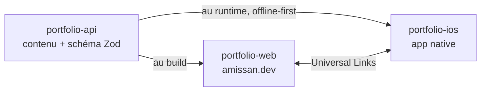

# Portfolio — Amissan Boris-David Amoussou-Guenou

Mon portfolio n'est pas une page. C'est un **système à trois produits** qui
partagent un seul contenu : une web app, une app iOS native, et l'API qui les
alimente.

Ce dépôt est le **hub** : il ne contient aucun code applicatif. Il porte ce qui
appartient à plusieurs dépôts à la fois — les décisions d'architecture, le contrat
des deep links, le schéma de contenu, et les tokens de design partagés.

## Le système

| Dépôt | Rôle |
|---|---|
| [`portfolio-web`](https://github.com/Boris-David/portfolio-web) | La web app — Next.js, React Server Components, TypeScript strict |
| [`portfolio-ios`](https://github.com/Boris-David/portfolio-ios) | L'app native — Swift 6, SwiftUI, Clean Architecture en modules SPM |
| [`portfolio-api`](https://github.com/Boris-David/portfolio-api) | L'API et le contenu — Hono, Zod, OpenAPI dérivé, Cloud Run |

## Pourquoi c'est fait comme ça

Les décisions sont écrites, datées, et exposent ce qui a été **écarté** :

- [0001 — Quatre dépôts plutôt qu'un monorepo](docs/adr/0001-quatre-depots.md)
- [0002 — Une source unique de contenu, servie par une API](docs/adr/0002-source-unique-de-contenu.md)
- [0003 — Choix des stacks](docs/adr/0003-choix-des-stacks.md)

Deux principes traversent l'ensemble :

**Une seule source de vérité.** Le contenu est défini une fois, dans un schéma ;
les types, le contrat d'API et l'instantané embarqué dans l'app s'en *dérivent*.
Rien n'est écrit deux fois, donc rien ne peut diverger.

**Les invariants sont mécaniques, pas déclaratifs.** Les couches de l'app iOS sont
des modules séparés : une dépendance interdite ne passe pas la compilation. Les
gardes de ce dépôt sont des hooks exécutables et testés, pas des consignes. Une
règle que rien n'applique ne protège rien.

## Ce que ce dépôt garantit

| Geste | Ce qui se passe |
|---|---|
| commit sous une identité autre que personnelle | **refusé** ([`.githooks/pre-commit`](.githooks/pre-commit)) |
| contenu indexé portant un marqueur d'employeur ou une clé | **refusé** — ces dépôts sont publics, l'historique est irréversible |

---

**Contact** — amissan.ag@outlook.fr
